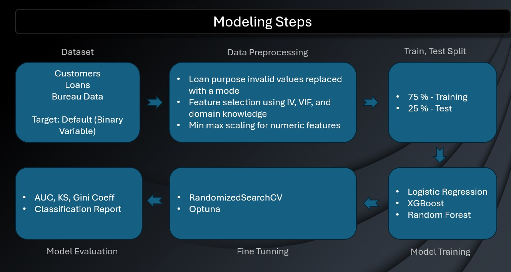

# Development of Credit Risk Model for LZ Finance

Project Overview: LZ Finance, a Non-Banking Financial Company (NBFC) based in India, is partnering with "LIVIS ai", a leading AI service provider, to develop a sophisticated credit risk model. This model will include a credit scorecard that categorizes loan applications into Poor, Average, Good, and Excellent categories, based on criteria similar to the CIBIL scoring system. 

🔗 **Live Demo** → [Credit Risk Model](https://development-of-credit-risk-model-for-lauki-livis-ai.streamlit.app/)  

---

## Scope of Work: 

- [Phase 1: Development and Implementation]
  - --1. **Model Development**: Build a predictive model using LZ Finance’s dataset which includes historical loan data and default  
         indicators. 
  - --2. **Scorecard Creation**: Develop a scoring system that categorizes credit scores into Poor, Average, Good, and Excellent. 
  - --3. **Streamlit UI Application**: Develop a user-friendly interface where loan officers can input borrower demographics, loan details,  
         and bureau information (such as credit utilization and open accounts) to obtain predictions on default probabilities and credit 
         ratings. 

## Dataset:
 - --1. **Customer Dataset**-It contain features Customer ID, Age of Customer, Gender, Marital status, Employment status, Income of 
	customer, Number of dependants, Residence type, Years at present address, City, state, Zip code.

 - --2. **Loan Dataset**-It contains features Loan ID, Customer ID, Loan purpose, Loan type, Sanction amount, loan amount, Amount disbursed, 
        Loan tenure, Principal outstanding, Bank balance at application, Disbursed date, Installment start date, Default/No default.

- --3. **Bureau Data**--it contain features Customer ID, total number of open accounts till date, total number of closed account till date, 
       total loan in months, total delinquent in months, Total due passed day, Total enquiry count, Credit utilization ratio.

## Architecture(Modelling Steps):
- -- 

## Live Demo
https://development-of-credit-risk-model-for-lauki-livis-ai.streamlit.app/
